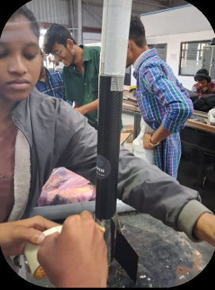
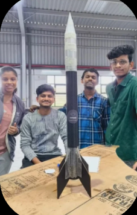
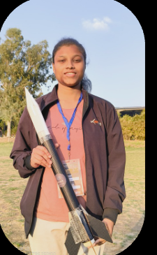
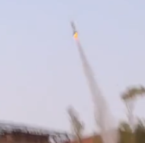
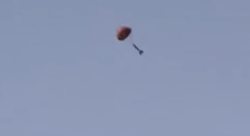
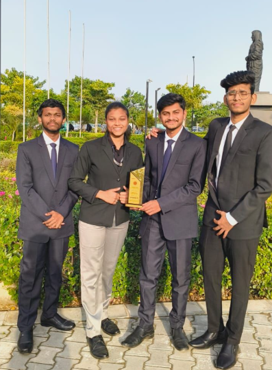
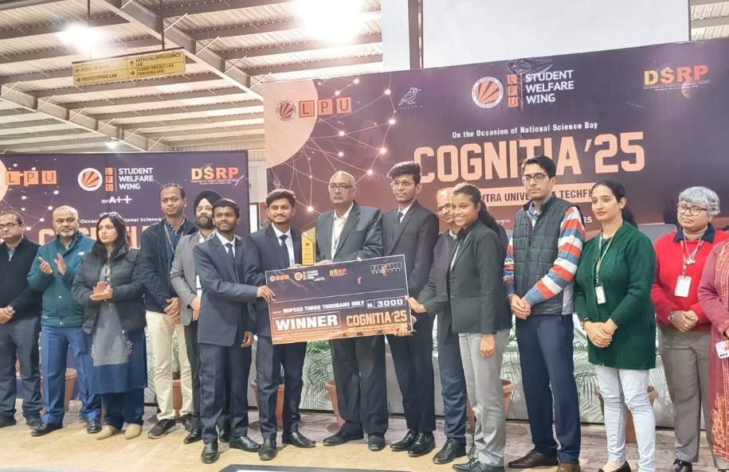
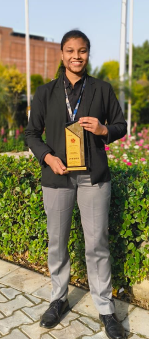
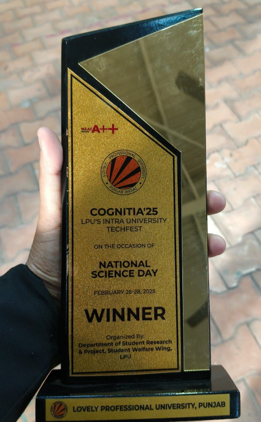

# E-Class Solid Propellant Rocket with Parachute Recovery System

## Project Overview

This project presents the design, fabrication, and flight testing of an **E-Class solid propellant rocket** equipped with an integrated **parachute recovery system**. Developed for **Cognitia 2025**, Lovely Professional University's annual technical competition, the project combined propulsion system development, structural design, manufacturing, and experimental flight validation.

The primary objective was to develop a reliable model rocket capable of stable powered flight and safe recovery while demonstrating practical applications of aerospace engineering principles.

---

## Objectives

- Design and develop an E-Class solid propellant rocket.
- Evaluate the performance of a KNO₃–Sucrose solid propellant.
- Design and integrate a parachute-based recovery system.
- Manufacture lightweight structural components using 3D printing.
- Conduct successful launch and recovery demonstrations.
- Validate propulsion and recovery system performance through flight testing.

---

## Rocket Specifications

| Parameter | Value |
|----------|-------|
| Rocket Class | E-Class |
| Approximate Thrust | 27 N |
| Propellant | Potassium Nitrate (KNO₃) + Sucrose |
| Recovery System | Parachute Deployment |
| Manufacturing | 3D Printed Components |
| Flight Type | Experimental Model Rocket |

---

## Project Development

The project involved the complete engineering workflow, including:

- Rocket body and structural design
- Propellant preparation and motor assembly
- Recovery system integration
- Vehicle assembly
- Flight preparation
- Launch testing
- Post-flight recovery and evaluation

---

## Key Contributions

- Designed and assembled an E-Class solid rocket.
- Evaluated solid propellant performance for stable combustion.
- Integrated a parachute recovery mechanism.
- Participated in structural assembly and launch preparation.
- Assisted in propulsion system testing and flight validation.
- Contributed to post-flight recovery and performance evaluation.

---

## Software & Tools

- SolidWorks / CAD Design
- 3D Printing
- Microsoft Excel
- Arduino IDE
- Experimental Testing Equipment

---

## Rocket Development

### Rocket Assembly

### Final Rocket Configuration

### Rocket with Author

---

## Flight Demonstration

### Rocket Launch

### Successful Recovery

---

## Team

### Project Team

---

## Awards & Recognition

🏆 **Winner – Cognitia 2025**

The project secured **First Place** at **Lovely Professional University's Cognitia 2025 Technical Competition**, recognizing excellence in design, innovation, and successful flight demonstration.

### Award Ceremony

### Recognition

---

## Project Highlights

- Successfully designed and fabricated an E-Class rocket.
- Demonstrated stable powered flight.
- Achieved successful parachute deployment and recovery.
- Integrated lightweight 3D-printed structural components.
- Validated propulsion and recovery system performance through experimental testing.
- Awarded **Winner – Cognitia 2025**.

---

## Skills Demonstrated

- Rocket Propulsion
- Solid Propellant Systems
- Aerospace Design
- CAD Modeling
- 3D Printing
- Structural Assembly
- Recovery System Design
- Experimental Testing
- Flight Operations
- Engineering Teamwork

---

## Author

**Laxmipriya Murmu**

B.Tech Aerospace Engineering  
Lovely Professional University

**Interests:** Rocket Propulsion • Space Systems • CFD • Aerodynamics

---

## Acknowledgements

This project was developed as part of the **Cognitia 2025 Technical Competition** at **Lovely Professional University**, with the collaborative efforts of the project team and the guidance of faculty mentors.
